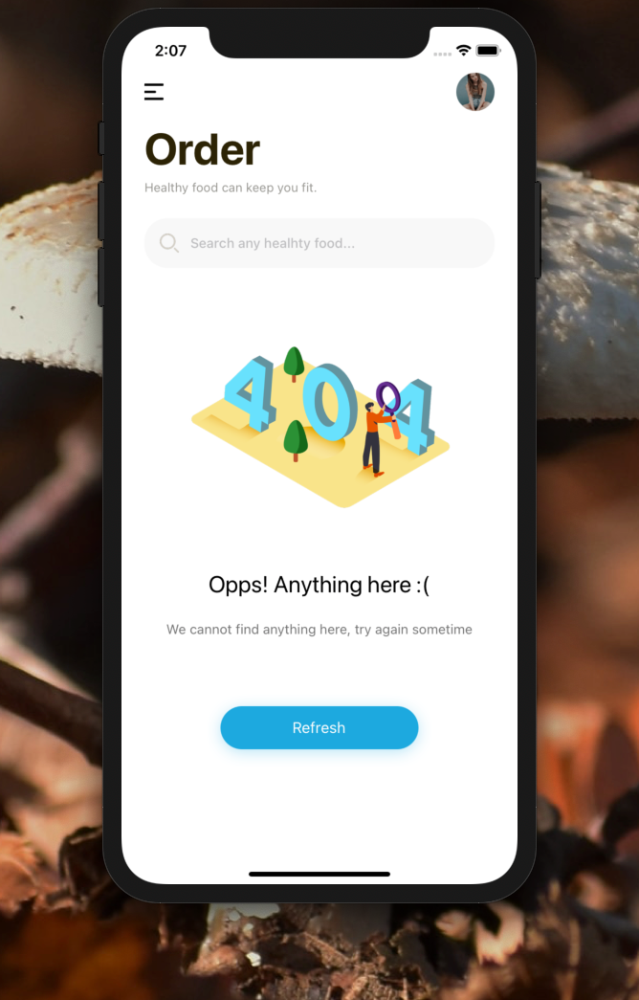

[](https://github.com/WrathChaos/react-native-empty-state)

[](https://www.npmjs.com/package/@freakycoder/react-native-empty-state)
[](https://www.npmjs.com/package/@freakycoder/react-native-empty-state)

[](https://opensource.org/licenses/MIT)
[](https://github.com/prettier/prettier)

<p align="center">
  
</p>

# Installation

Add the dependency:

```bash
npm i @freakycoder/react-native-empty-state
```

## Peer Dependencies

<h5><i>IMPORTANT! You need install them</i></h5>

```js
"@freakycoder/react-native-bounceable": ">= 0.2.2",
```

# Usage

## Import

```jsx
import EmptyState from "@freakycoder/react-native-empty-state";
```

## Fundamental Usage

```jsx
<EmptyState
  enableButton
  buttonText="Refresh"
  imageSource={emptyStateImage}
  title="Opps! Anything here :("
  description="We cannot find anything here, try again sometime"
/>
```

## Example Project 😍

You can checkout the example project 🥰

Simply run

- `npm i`
- `react-native run-ios/android`

should work of the example project.

# Configuration - Props

## Fundamentals

| Property    |  Type  |  Default  | Description            |
| ----------- | :----: | :-------: | ---------------------- |
| title       | string | undefined | change the title       |
| description | string | undefined | change the description |

## Customization (Optionals)

| Property                  |    Type    |  Default  | Description                                                            |
| ------------------------- | :--------: | :-------: | ---------------------------------------------------------------------- |
| enableButton              |  boolean   |   false   | let you enable the button (must use it for button)                     |
| onPress                   |  function  | undefined | set your own logic for the button functionality when it is pressed     |
| buttonText                |   string   | undefined | change the button's text                                               |
| style                     | ViewStyle  |  default  | set or override the style object for the main container                |
| buttonStyle               | ViewStyle  |  default  | set or override the style object for the button style                  |
| titleTextStyle            | TextStyle  |  default  | set or override the style object for the title text style              |
| buttonTextStyle           | TextStyle  |  default  | set or override the style object for the button's text style           |
| descriptionTextStyle      | TextStyle  |  default  | set or override the style object for the description text style        |
| containerGlueStyle        | ViewStyle  |  default  | set or override the style object for the container glue style          |
| descriptionContainerStyle | ViewStyle  |  default  | set or override the style object for the description container style   |
| imageStyle                | ImageStyle |  default  | set or override the style object for the image style                   |
| ImageComponent            |   Image    |  default  | set your own component instead of default react-native Image component |

## Future Plans

- [x] ~~LICENSE~~

## Author

FreakyCoder, kurayogun@gmail.com

## License

React Native Empty State is available under the MIT license. See the LICENSE file for more info.
